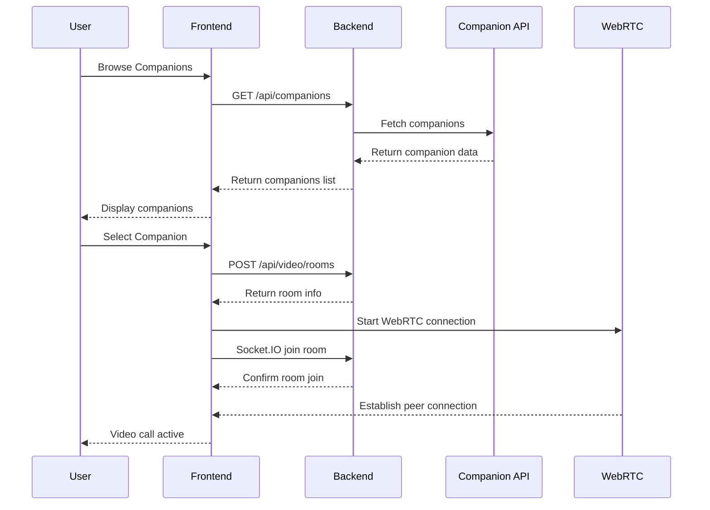
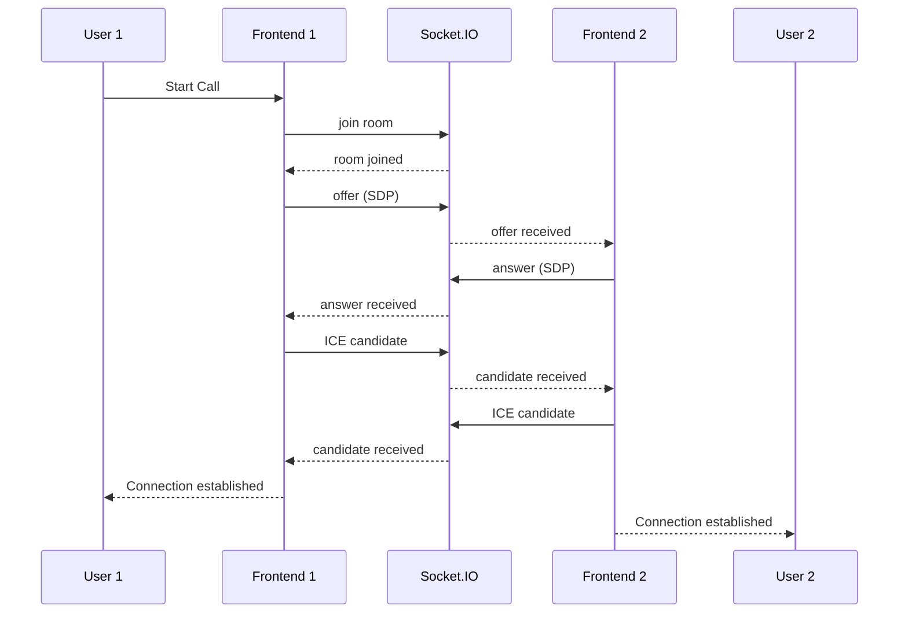
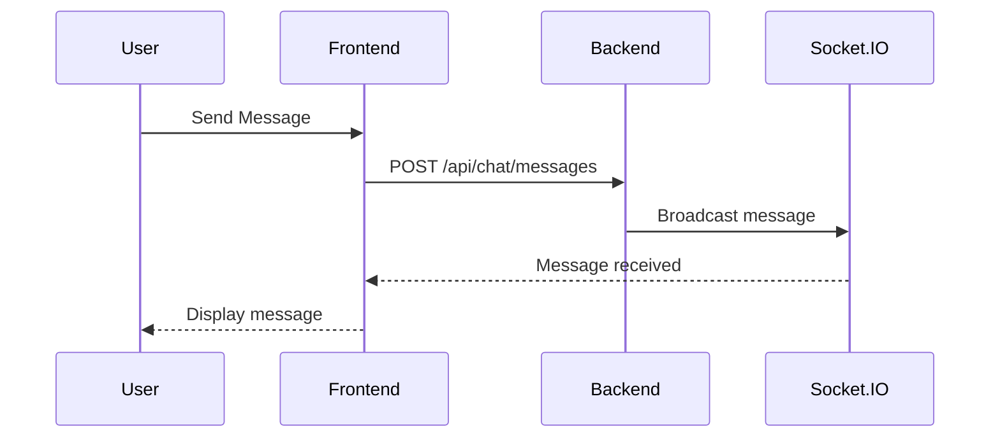

# Architecture Documentation

## System Overview

The AI Companion Video Call & Streaming platform is built with a modern microservices architecture, separating concerns between frontend, backend API, and real-time communication layers.

## Architecture Diagram

```
┌─────────────────┐    ┌─────────────────┐    ┌─────────────────┐
│   Frontend      │    │   Backend API   │    │  External APIs  │
│   (Next.js)     │◄──►│   (FastAPI)     │◄──►│  (Companions)   │
│   Port 3000     │    │   Port 8000     │    │                 │
└─────────────────┘    └─────────────────┘    └─────────────────┘
         │                       │
         │              ┌─────────────────┐
         └──────────────►│  Socket.IO      │
                        │  (WebSocket)    │
                        │  Signaling      │
                        └─────────────────┘
                                 │
                        ┌─────────────────┐
                        │     WebRTC       │
                        │  Peer-to-Peer   │
                        │   Video/Audio   │
                        └─────────────────┘
```

## Component Architecture

### Frontend Layer (Next.js + TypeScript)
- **Pages**: Landing page, companions browser, video call interface
- **Components**: VideoCallModal, companion cards, call controls
- **Hooks**: useWebRTC for WebRTC management
- **Styling**: Tailwind CSS for responsive design

### Backend Layer (FastAPI + Python)
- **REST API**: Video rooms, companions, WebRTC config, chat, recordings
- **WebSocket Server**: Socket.IO for real-time signaling
- **Services**: Companion service, WebRTC config service
- **Models**: Pydantic models for data validation

### External Integrations
- **Companion API**: https://persona-fetcher-api.up.railway.app/personas
- **WebRTC STUN/TURN**: Public STUN servers, configurable TURN servers

## Sequence Diagrams

### Video Call Flow



### WebRTC Signaling Flow



### Chat Message Flow



## Data Flow Architecture

### Companion Data Flow
1. Frontend requests companions from `/api/companions`
2. Backend proxies request to external API
3. External API returns companion data with voice IDs
4. Backend processes and returns to frontend
5. Frontend displays companion cards

### Video Room Management
1. User selects companion
2. Frontend creates video room via API
3. Backend stores room metadata in memory
4. Frontend joins Socket.IO room
5. WebRTC signaling begins

### Real-time Communication
1. Socket.IO handles signaling (offers, answers, candidates)
2. WebRTC establishes peer-to-peer connection
3. Media streams directly between browsers
4. Chat messages flow through Socket.IO

## Design Decisions

### TURN/SFU Usage
- **Current**: Public STUN servers only
- **Rationale**: Demo environment, local development
- **Production**: Configure TURN servers for NAT traversal
- **Future**: Consider SFU for multi-party calls

### Storage Strategy
- **Current**: In-memory storage
- **Rationale**: Simplified demo setup
- **Production**: Redis for session persistence
- **Scaling**: Database for user/room persistence

### WebRTC Architecture
- **Choice**: Peer-to-peer (P2P)
- **Rationale**: Direct browser-to-browser communication
- **Benefits**: Low latency, reduced server load
- **Limitations**: NAT traversal challenges

## Security Considerations

### CORS Configuration
- Configured for localhost development
- Production: Restrict to specific domains

### WebRTC Security
- HTTPS required for production
- Secure ICE servers configuration
- Media encryption via WebRTC

### API Security
- Input validation via Pydantic
- Rate limiting (to be implemented)
- Authentication (to be implemented)

## Performance Considerations

### Frontend Optimization
- Next.js automatic code splitting
- Image optimization for companion avatars
- WebRTC connection pooling

### Backend Optimization
- Async/await for non-blocking operations
- Connection pooling for external APIs
- In-memory caching for companion data

### Scalability
- Horizontal scaling via load balancers
- Redis clustering for session storage
- CDN for static assets

## Monitoring and Logging

### Application Logs
- Structured logging with Python logging
- Request/response logging
- WebRTC connection status

### Metrics
- API response times
- WebRTC connection success rates
- Companion API response times

## Future Enhancements

### AI Integration
- Google Gemini for companion responses
- LangMem for conversation memory
- Voice synthesis with ElevenLabs

### Advanced Features
- Multi-party video calls
- Screen sharing
- Call recording and playback
- Companion personality customization

### Infrastructure
- Kubernetes deployment
- Auto-scaling based on load
- Global CDN distribution